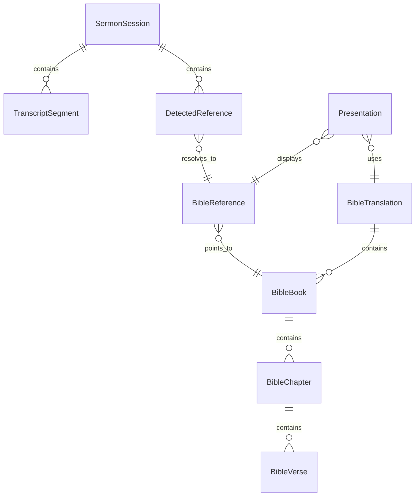

# Church AI Sermon Intelligence & Bible Presentation System
## Documentation Set — Part 3: Domain Model

---

## 1. Approach

Entities from the original candidate list are triaged into **MVP** and **Future** based on whether the MVP workflow (PRD §1.11) requires them. `Church`, `User`, `Role` are deferred — MVP is single-operator, single-installation, no multi-tenant or auth model — but the schema is shaped so they can be introduced later without restructuring existing tables (see Database Design, Part 4, migration notes).

## 2. MVP Domain Entities

| Entity | Type | MVP? | Notes |
|---|---|---|---|
| SermonSession | Aggregate root | Yes | One per Start→Stop run |
| TranscriptSegment | Entity (child of SermonSession) | Yes | Timestamped STT output chunk |
| BibleTranslation | Entity | Yes | e.g., KJV, NIV — licensing-dependent |
| BibleBook | Entity (reference data) | Yes | 66 canonical books, aliases |
| BibleChapter | Entity (reference data) | Yes | |
| BibleVerse | Entity (reference data) | Yes | Leaf of Bible reference data |
| BibleReference | Value Object | Yes | Canonical (Book, Chapter, VerseStart, VerseEnd?) — immutable |
| DetectedReference | Entity (child of SermonSession) | Yes | Raw detection event, pre/post resolution |
| DetectionEvent | *Merged into DetectedReference for MVP* | — | See note below |
| Presentation / PresentationItem | Entity | Yes (minimal) | Current on-screen state; MVP has one active item, not a queue |
| Display | Value Object | Yes | Selected secondary monitor descriptor |
| AIProvider / AIModel | Entity/config | Yes (config-level) | Which local model is active |
| SpeechProvider | Entity/config | Yes (config-level) | Which STT engine is active |
| AudioDevice | Value Object | Yes | Selected mic descriptor |
| SystemSetting | Entity | Yes | Key/value app configuration |
| Church | Entity | **Future** | Deferred — single-installation MVP |
| User | Entity | **Future** | Deferred — no auth/multi-user MVP |
| Role | Entity | **Future** | Deferred, depends on User |
| Sermon (as distinct from SermonSession) | — | **Future** | MVP conflates "sermon" and "session"; a distinct Sermon entity (metadata: title, speaker, series) is a Phase 4 addition |

**Design note on DetectionEvent vs DetectedReference:** the original candidate list treats these as separate entities. [Strong Inference] For MVP they should be merged: a `DetectedReference` already carries its lifecycle state (see State Machine, Document 13) and audit fields (detected-at, resolved-at, source). Introducing a separate `DetectionEvent` log table before there's a concrete need (e.g., analytics on detection accuracy over time) adds a join and a synchronization burden without MVP benefit. This is recorded as a documented assumption, not a silent omission — revisit in Phase 4 if sermon analytics require an append-only event log distinct from current-state records.

## 3. Aggregates

- **SermonSession** (aggregate root) — owns `TranscriptSegment[]` and `DetectedReference[]`. Session-level invariants (e.g., cannot add a TranscriptSegment to a Completed session) are enforced here.
- **BibleTranslation** (aggregate root for reference data) — owns `BibleBook[]` → `BibleChapter[]` → `BibleVerse[]`. This subtree is read-only at runtime from the application's perspective; it is seeded/imported, not edited through the normal domain workflow.
- **Presentation** — a small aggregate representing "what's currently on the projector," referencing a `BibleReference` + `BibleTranslation`, not owning verse text (verse text is fetched, not duplicated, to avoid staleness if a translation is corrected).

## 4. Value Objects

| Value Object | Fields | Notes |
|---|---|---|
| BibleReference | Book, Chapter, VerseStart, VerseEnd (nullable) | Immutable; equality by value; whole-chapter references have VerseStart=VerseEnd=null |
| Display | DeviceId, Name, Resolution, IsPrimary | |
| AudioDevice | DeviceId, Name | |
| ConfidenceScore | Numeric 0.0–1.0 + Source enum (Deterministic / AIAssisted) | |

## 5. Enumerations

```
SermonSessionState: Idle, Listening, Transcribing, Detecting, AwaitingApproval, Displaying, Paused, Completed, Error
DetectedReferenceState: Detected, Processing, Resolved, Validated, PendingApproval, Approved, Rejected, Displayed
DetectionSource: Deterministic, AIAssisted
ApprovalAction: Display, Ignore, Edit
```

(Full transition rules are defined in Document 13, State Machines — not duplicated here.)

## 6. Domain Services

| Service | Responsibility | Notes |
|---|---|---|
| BibleReferenceDetectionService | Runs deterministic + AI-assisted detection over a TranscriptSegment, producing DetectedReference candidates | Pure orchestration; delegates to `IBibleReferenceDetector` / `IBibleReferenceResolver` (see Doc 11) |
| BibleReferenceNormalizationService | Converts raw parsed tokens (book alias, spoken numbers, ranges) into a canonical BibleReference value object | No I/O; fully unit-testable |
| PassageLookupService | Resolves a validated BibleReference + BibleTranslation into verse text via the Bible repository | |
| SessionLifecycleService | Enforces SermonSession state transitions | |

## 7. Business Rules (representative, not exhaustive — full set lives with each Use Case)

- BR-01: A `DetectedReference` may not transition to `Displayed` without passing through `Approved` (human-in-the-loop, ADR-008), except via the manual-search path, which creates its own directly-approved reference rather than bypassing the rule.
- BR-02: `BibleVerse` text is never written or modified by AI output (ADR-007).
- BR-03: AI-assisted resolution (`DetectionSource.AIAssisted`) may only be invoked when deterministic confidence is below the configured threshold (FR-BIBLE-005); it must not be the default path.
- BR-04: A `SermonSession` in `Completed` or `Error` state is immutable — no further `TranscriptSegment` or `DetectedReference` may be appended.

## 8. Entity Relationship Overview (conceptual, not physical schema — see Document 4/Database Design for ERD)


