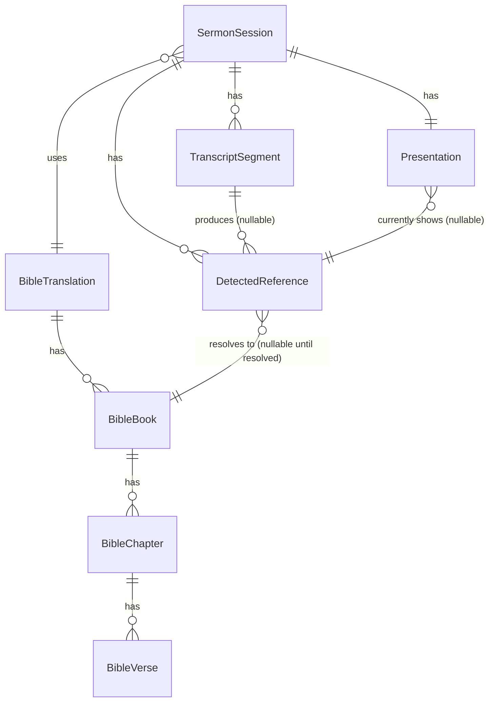

# Church AI Sermon Intelligence & Bible Presentation System
## Documentation Set — Part 4: Database Design (SQLite, MVP)

---

## 1. Design Note (per ADR-011)

Two logical stores, one physical SQLite file is acceptable for MVP, but they are accessed differently:

- **Reference data** (`BibleTranslation`, `BibleBook`, `BibleChapter`, `BibleVerse`) — read-only at runtime, imported once from a licensed source. Accessed via **Dapper/ADO.NET**, not EF Core, for lookup-path latency (NFR-PERF-002).
- **Mutable data** (`SermonSession`, `TranscriptSegment`, `DetectedReference`, `Presentation`, `SystemSetting`) — accessed via **EF Core**, migrations managed normally.

## 2. Tables

### 2.1 Reference Data

**BibleTranslation**
| Column | Type | Notes |
|---|---|---|
| Id | INTEGER PK | |
| Code | TEXT UNIQUE | e.g. "KJV", "NIV" |
| Name | TEXT | Display name |
| Language | TEXT | ISO code |
| LicenseInfo | TEXT | Free-text license/attribution note |
| IsActive | INTEGER (bool) | |

**BibleBook**
| Column | Type | Notes |
|---|---|---|
| Id | INTEGER PK | |
| TranslationId | INTEGER FK → BibleTranslation.Id | |
| CanonicalOrder | INTEGER | 1–66, for sorting |
| Name | TEXT | e.g. "Romans" |
| Testament | TEXT | "OT" / "NT" |
| Aliases | TEXT (JSON array) | e.g. `["Rom", "Romans", "Rom."]` — used by normalization layer |

**BibleChapter**
| Column | Type | Notes |
|---|---|---|
| Id | INTEGER PK | |
| BookId | INTEGER FK → BibleBook.Id | |
| ChapterNumber | INTEGER | |

**BibleVerse**
| Column | Type | Notes |
|---|---|---|
| Id | INTEGER PK | |
| ChapterId | INTEGER FK → BibleChapter.Id | |
| VerseNumber | INTEGER | |
| Text | TEXT | Exact verse text |

Indexes: `IX_BibleBook_TranslationId_Name`, `IX_BibleChapter_BookId_ChapterNumber`, `IX_BibleVerse_ChapterId_VerseNumber` (composite, unique — this is the hot lookup path).

### 2.2 Mutable Data

**SermonSession**
| Column | Type | Notes |
|---|---|---|
| Id | GUID/TEXT PK | |
| StartedAt | DATETIME | |
| EndedAt | DATETIME NULL | |
| State | TEXT | Enum: SermonSessionState |
| TranslationId | INTEGER FK | Active translation for this session |
| CreatedAt / UpdatedAt | DATETIME | Audit fields |

**TranscriptSegment**
| Column | Type | Notes |
|---|---|---|
| Id | GUID/TEXT PK | |
| SermonSessionId | GUID FK → SermonSession.Id | |
| Text | TEXT | |
| StartOffsetMs | INTEGER | Relative to session start |
| EndOffsetMs | INTEGER | |
| CreatedAt | DATETIME | |

Index: `IX_TranscriptSegment_SermonSessionId_StartOffsetMs`

**DetectedReference**
| Column | Type | Notes |
|---|---|---|
| Id | GUID/TEXT PK | |
| SermonSessionId | GUID FK → SermonSession.Id | |
| TranscriptSegmentId | GUID FK → TranscriptSegment.Id NULL | Null for manually-initiated references |
| RawText | TEXT | As detected, pre-normalization |
| BookId | INTEGER FK NULL | Populated once resolved |
| ChapterNumber | INTEGER NULL | |
| VerseStart | INTEGER NULL | |
| VerseEnd | INTEGER NULL | |
| ConfidenceScore | REAL | 0.0–1.0 |
| DetectionSource | TEXT | Enum: Deterministic / AIAssisted |
| State | TEXT | Enum: DetectedReferenceState |
| DetectedAt | DATETIME | |
| ResolvedAt | DATETIME NULL | |
| ApprovedAt | DATETIME NULL | |
| CreatedAt / UpdatedAt | DATETIME | Audit fields |

Index: `IX_DetectedReference_SermonSessionId_DetectedAt`

**Presentation** (MVP: single current-state row per session, not a full history table — history is derivable from DetectedReference.State=Displayed + timestamps)
| Column | Type | Notes |
|---|---|---|
| Id | GUID/TEXT PK | |
| SermonSessionId | GUID FK → SermonSession.Id | |
| DetectedReferenceId | GUID FK NULL | Currently displayed reference, if any |
| DisplayDeviceId | TEXT | Selected monitor descriptor |
| IsVisible | INTEGER (bool) | |
| UpdatedAt | DATETIME | |

**SystemSetting**
| Column | Type | Notes |
|---|---|---|
| Key | TEXT PK | |
| Value | TEXT | |
| UpdatedAt | DATETIME | |

## 3. ERD

## 4. Migration Strategy

- EF Core Code-First migrations govern the mutable-data tables from day one.
- Reference data (Bible text) is **not** managed via EF migrations — it's seeded via a one-time import script from the licensed source dataset, versioned independently (a translation update is a data-replace operation, not a schema migration).
- `SystemSetting` as a flexible key/value table absorbs new configuration needs without schema churn during MVP iteration.

## 5. SQLite → PostgreSQL Migration Path

[Strong Inference] This is achievable without rewriting Domain/Application layers **provided** the Infrastructure layer's EF Core `DbContext` avoids SQLite-specific function calls (e.g., avoid raw SQL using SQLite-only pragmas) and the Dapper-based Bible repository is written against ADO.NET abstractions (`DbConnection`/`DbCommand`) rather than SQLite-specific APIs directly. Concretely:

1. Domain and Application layers reference only `IBibleRepository`, `ISessionRepository`, etc. — no direct SQLite/EF types leak upward (already required by NFR-MAINT-002).
2. Infrastructure layer swaps the EF Core provider (`Microsoft.EntityFrameworkCore.Sqlite` → `Npgsql.EntityFrameworkCore.PostgreSQL`) and the Dapper connection factory.
3. GUID/TEXT primary keys were chosen over SQLite `INTEGER AUTOINCREMENT` specifically to avoid PK-generation semantics that don't translate cleanly to Postgres `SERIAL`/`IDENTITY`.
4. Reference-data import script is re-run against the new backend rather than migrated row-by-row, since it's a one-time seed, not live data.

This migration is not needed for MVP and should not be built preemptively (ADR-003) — the point of this section is to confirm the schema doesn't create a dead end, not to implement the migration now.
